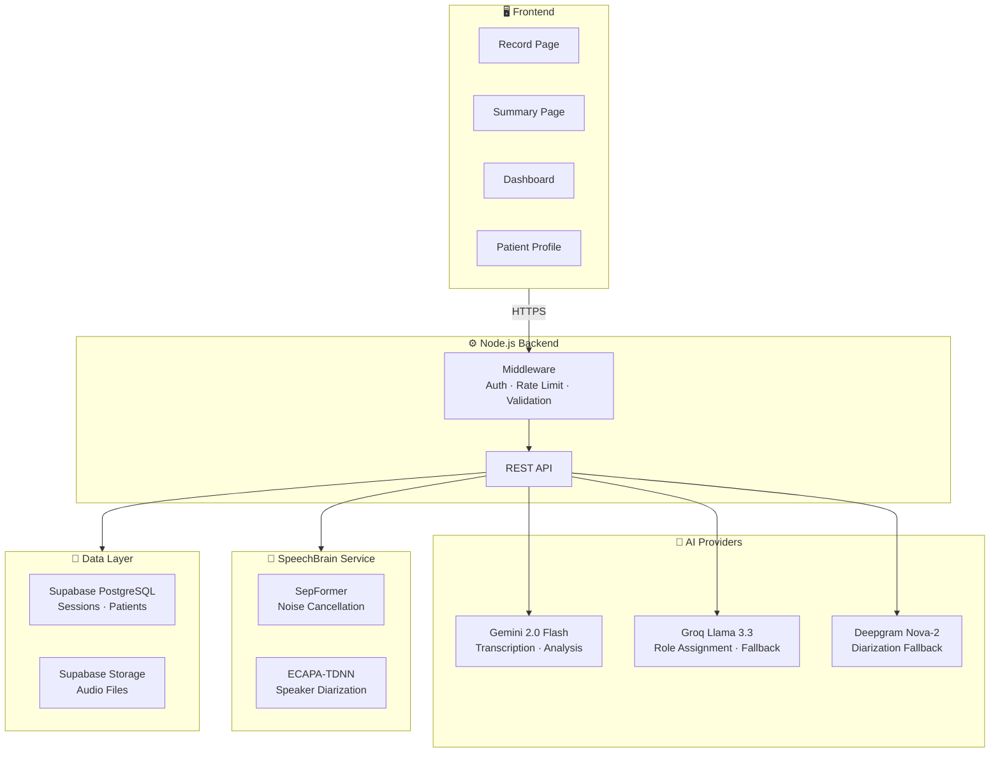
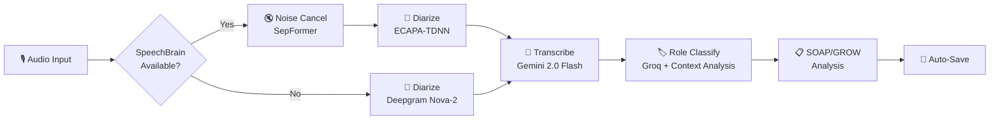
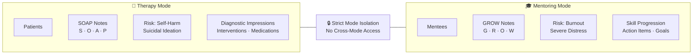
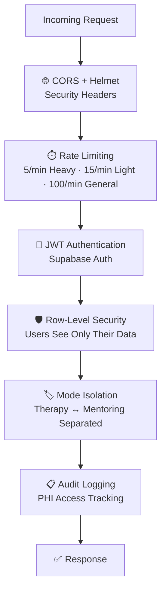

# 🩺 EchoScribe v2.0

**AI-powered clinical documentation platform with multi-provider speech processing, SpeechBrain noise cancellation, speaker diarization, SOAP/GROW note generation, dual Therapy/Mentoring modes, risk assessment, and longitudinal client intelligence.**

[](https://echoscribe-vert.vercel.app)
[](https://speechbrain.github.io/)

---

## ✨ Features

| Feature | Description |
|---|---|
| 🎙️ **Multi-Provider Transcription** | Gemini 2.0 Flash (primary), Groq Llama 3.3 (fallback), Deepgram Nova-2 (audio fallback) with automatic failover |
| 🔇 **SpeechBrain Noise Cancellation** | SepFormer neural network removes background noise before transcription for cleaner results |
| 🗣️ **Advanced Speaker Diarization** | SpeechBrain ECAPA-TDNN embeddings + spectral clustering (primary), Deepgram Nova-2 (fallback) |
| 🧠 **Contextual Role Classification** | 8-signal analysis (speaking time, questions, clinical vocab, guiding phrases, emotional language) + LLM classification via Groq |
| 🏥 **Dual Mode: Therapy + Mentoring** | SOAP notes for clinical therapy, GROW notes for academic mentoring — with strict data isolation |
| ⚠️ **Risk Assessment** | Automated detection of self-harm/suicidal ideation (Therapy) and academic burnout (Mentoring) |
| 👤 **Patient/Mentee Hub** | Full CMS with longitudinal AI profiling across sessions |
| 📊 **Visual Analytics** | Chart.js dashboards with topic distribution (polar), emotional tone (doughnut), progress tracking |
| 📄 **Rich PDF Export** | Comprehensive reports with SOAP/GROW, risk, interventions, communication, AI provider info |
| 📧 **Patient Communication** | Auto-generated take-home instructions via Resend API email |
| 🗑️ **Session Management** | Auto-save on analysis, delete sessions with confirmation |
| 🔐 **Security** | JWT auth, Supabase RLS, Helmet, CORS, tiered rate limiting, PHI audit logging |
| 🌐 **12 Languages** | English, Malayalam, Tamil, Hindi, Spanish, French, German, Japanese, Korean, Chinese, Portuguese, Arabic |
| ⚡ **Vercel Edge Ready** | Serverless deployment with SpeechBrain auto-fallback |

---

## 🧪 AI Provider Architecture

EchoScribe uses a **multi-provider round-robin architecture** with automatic failover:

```
Audio Upload
    │
    ├─ [SpeechBrain Available?]
    │     ├─ YES → SepFormer (noise cancel) → ECAPA-TDNN (diarize)
    │     └─ NO  → Deepgram Nova-2 (diarize)
    │
    ├─ Gemini 2.0 Flash (transcribe clean audio)
    │     └─ Fallback: Deepgram Nova-2
    │
    ├─ Groq Llama 3.3 (role assignment: Therapist/Patient or Mentor/Mentee)
    │     └─ Fallback: Gemini 2.0 Flash
    │
    └─ Gemini 2.0 Flash (SOAP/GROW analysis)
          └─ Fallback: Groq Llama 3.3
```

### Gemini Key Pool
- Supports **multiple API keys** via round-robin (`GEMINI_API_KEYS=key1,key2,key3`)
- Automatic failover on quota/rate limits (60s cooldown)
- Permanent disable for invalid keys
- Falls back to Groq + Deepgram when all Gemini keys are exhausted

### Role Classification (8-Signal Analysis)
The `computeSpeakerStats()` function extracts these signals from audio metadata:
1. Total speaking time
2. Word count + avg words per turn
3. Question frequency
4. Clinical/professional vocabulary density
5. Guiding/directing phrases
6. Emotional/personal phrases
7. Turn count
8. Who spoke first

---

## 🔊 SpeechBrain Integration

EchoScribe includes an optional **Python FastAPI microservice** powered by [SpeechBrain](https://speechbrain.github.io/):

| Model | Task | HuggingFace ID |
|---|---|---|
| **SepFormer** | Noise Cancellation | `speechbrain/sepformer-wham16k-enhancement` |
| **ECAPA-TDNN** | Speaker Embeddings | `speechbrain/spkrec-ecapa-voxceleb` |

**Diarization Pipeline:**
1. Enhance audio → Remove noise using SepFormer
2. Segment → 1.5s windows, 0.75s overlap
3. Extract embeddings → ECAPA-TDNN on each segment
4. Cluster → Spectral clustering (k=2 speakers)
5. Merge → Combine adjacent same-speaker segments

> **Note:** SpeechBrain requires Python + PyTorch (~2GB). When unavailable, EchoScribe automatically falls back to Deepgram Nova-2 for diarization.

---

## 🛠️ Tech Stack

| Layer | Technologies |
|---|---|
| **Backend** | Node.js, Express, Helmet, CORS, Tiered Rate Limiting |
| **AI (Transcription)** | Gemini 2.0 Flash (primary), Deepgram Nova-2 (fallback) |
| **AI (Analysis)** | Gemini 2.0 Flash (primary), Groq Llama 3.3 70B (fallback) |
| **AI (Diarization)** | SpeechBrain ECAPA-TDNN (primary), Deepgram Nova-2 (fallback) |
| **AI (Noise Cancel)** | SpeechBrain SepFormer |
| **AI (Role ID)** | Groq Llama 3.3 (primary), Gemini 2.0 Flash (fallback) |
| **Database** | Supabase PostgreSQL + Row-Level Security |
| **Storage** | Supabase Storage (audio buckets) |
| **Email** | Resend API |
| **Frontend** | Vanilla HTML/CSS/JS, Chart.js |
| **Deployment** | Vercel (Node.js) + Railway/Render (SpeechBrain Python) |

---

## 📐 Architecture Diagrams

### System Overview



### Audio Processing Pipeline



### Dual-Mode Data Flow



### Security Layers



---

## 📁 Project Structure

```
ECHOSCRIBE/
├── src/
│   ├── config/env.js                  # Zod environment validation
│   ├── middleware/
│   │   ├── security.js                # Helmet, CORS, tiered rate limiting
│   │   ├── auth.js                    # JWT auth middleware
│   │   ├── compliance.js              # PHI audit logging
│   │   ├── validate.js                # Zod request validation
│   │   └── errorHandler.js            # AppError class + asyncHandler
│   ├── services/
│   │   ├── ai.service.js              # Gemini STT, SOAP/GROW, role ID, profiles
│   │   ├── gemini-pool.js             # Round-robin multi-key Gemini pool
│   │   ├── groq-fallback.js           # Groq Llama 3.3 fallback provider
│   │   ├── deepgram.service.js        # Deepgram Nova-2 diarization
│   │   ├── speechbrain-client.js      # SpeechBrain microservice HTTP client
│   │   └── db.service.js              # RLS-aware Supabase CRUD + Audio Storage
│   ├── controllers/
│   │   ├── auth.controller.js         # signup, login, logout, refresh
│   │   ├── session.controller.js      # summarize, auto-save, delete
│   │   ├── transcribe.controller.js   # SpeechBrain-first pipeline + Deepgram fallback
│   │   ├── patient.controller.js      # patient/mentee CMS & chart data
│   │   ├── profile.controller.js      # longitudinal AI profiling
│   │   ├── export.controller.js       # PDF, CSV, JSON export (full details)
│   │   └── communications.controller.js # Resend email integration
│   ├── routes/
│   │   ├── auth.routes.js             # /api/auth/*
│   │   └── api.routes.js              # /api/* (protected, Multer multipart)
│   ├── docs/swagger.js                # OpenAPI 3.0 spec
│   ├── python/                        # SpeechBrain microservice
│   │   ├── speechbrain_service.py     # FastAPI server (enhance + diarize)
│   │   ├── start_speechbrain.py       # Auto-install + launch script
│   │   └── requirements.txt           # Python dependencies
│   └── index.js                       # Primary entry point
├── public/
│   ├── app.js                         # Recorder, audio blob, upload logic
│   ├── summary.js                     # SOAP/GROW display, charts, history, delete
│   ├── dashboard.html                 # Mode toggle, patient directory
│   ├── record.html                    # Recording interface
│   ├── summary.html                   # Analysis display with provider badges
│   ├── patient.html / patient.js      # Patient profile + Chart.js analytics
│   ├── style.css                      # Core design system (dark theme)
│   └── card.css                       # Card, badge, provider-badge styles
├── supabase/
│   ├── create_patients_table.sql      # Patients table with entity_type
│   ├── setup_audio_storage.sql        # session-audio bucket + RLS
│   └── migrations/add_session_mode.sql # session_mode column
├── vercel.json                        # Serverless function config
└── .env.example                       # Environment template
```

---

## 🚀 Getting Started

### Prerequisites

- **Node.js** v18+
- **Python** 3.10+ (optional, for SpeechBrain)
- **Supabase** account ([supabase.com](https://supabase.com))
- **Gemini** API key(s) ([aistudio.google.com](https://aistudio.google.com))
- **Groq** API key ([console.groq.com](https://console.groq.com))
- **Deepgram** API key ([deepgram.com](https://deepgram.com))

### 1. Clone & Install

```bash
git clone https://github.com/Aravind-Krishnan-S/ECHOSCRIBE.git
cd ECHOSCRIBE/ECHOSCRIBE
npm install
```

### 2. Configure Environment

```bash
cp .env.example .env
```

Edit `.env` with your API keys:

```env
# AI Providers (at least one Gemini key required)
GEMINI_API_KEYS=key1,key2,key3
GROQ_API_KEY=gsk_your_groq_key
DEEPGRAM_API_KEY=your_deepgram_key

# Database
SUPABASE_URL=https://your-project.supabase.co
SUPABASE_KEY=your_supabase_anon_key

# Email (optional)
RESEND_API_KEY=re_your_resend_key
RESEND_FROM_EMAIL=EchoScribe <noreply@yourdomain.com>

# SpeechBrain (optional, default: http://localhost:5050)
SPEECHBRAIN_URL=http://localhost:5050

# Server
PORT=3000
NODE_ENV=development
CORS_ORIGIN=*
```

### 3. Set Up Supabase

1. **Enable Email/Password Auth:** Dashboard → Authentication → Providers → Email
2. **Run database setup SQL** in SQL Editor:

```sql
-- Sessions table
CREATE TABLE sessions (
  id UUID DEFAULT gen_random_uuid() PRIMARY KEY,
  user_id UUID NOT NULL REFERENCES auth.users(id) ON DELETE CASCADE,
  patient_id UUID REFERENCES patients(id),
  transcript TEXT,
  summary TEXT,
  analysis_json JSONB,
  audio_url TEXT,
  session_mode TEXT DEFAULT 'Therapy',
  created_at TIMESTAMPTZ DEFAULT now()
);

CREATE INDEX idx_sessions_user_id ON sessions(user_id);
CREATE INDEX idx_sessions_created_at ON sessions(created_at DESC);

ALTER TABLE sessions ENABLE ROW LEVEL SECURITY;
CREATE POLICY "Users CRUD own sessions" ON sessions
  USING (auth.uid() = user_id)
  WITH CHECK (auth.uid() = user_id);
```

3. Run `supabase/create_patients_table.sql` in the SQL Editor
4. Run `supabase/setup_audio_storage.sql` for the audio bucket

### 4. Start the Application

```bash
# Terminal 1: Start Node.js (required)
npm run dev

# Terminal 2: Start SpeechBrain (optional, first run downloads ~2GB)
python src/python/start_speechbrain.py
```

Open **http://localhost:3000** in your browser.

> When SpeechBrain is running, the console shows: `[SpeechBrain] ✅ Service available`
> When it's not, the app automatically uses Deepgram: `[SpeechBrain] ⚠️ using Deepgram fallback`

---

## 📡 API Endpoints

### Authentication (Public)

| Method | Endpoint | Description |
|---|---|---|
| `POST` | `/api/auth/signup` | Create account |
| `POST` | `/api/auth/login` | Login (returns JWT) |
| `POST` | `/api/auth/logout` | Logout |
| `GET` | `/api/auth/me` | Get current user |
| `POST` | `/api/auth/refresh` | Refresh JWT token |

### Protected (Requires Bearer Token)

| Method | Endpoint | Rate Limit | Description |
|---|---|---|---|
| `POST` | `/api/transcribe-audio` | 15/min | Transcribe audio (SpeechBrain → Gemini → Deepgram) |
| `POST` | `/api/identify-speakers` | 15/min | Identify speaker roles |
| `POST` | `/api/diarize-transcript` | 5/min | Text-based diarization |
| `POST` | `/api/summarize` | 5/min | SOAP/GROW analysis + auto-save |
| `GET` | `/api/history` | 100/min | Get session history |
| `DELETE` | `/api/session/:id` | 100/min | Delete a session |
| `GET` | `/api/profile` | 5/min | Longitudinal AI profiling |
| `GET/POST` | `/api/patients` | 100/min | Patient/mentee CRUD |
| `PUT/DELETE` | `/api/patients/:id` | 100/min | Update/delete patient |
| `GET` | `/api/export/pdf/:id` | 100/min | Export session as PDF |
| `GET` | `/api/export/csv` | 100/min | Export all sessions as CSV |
| `GET` | `/api/export/record` | 100/min | Export full record as JSON |
| `POST` | `/api/send-communication` | 100/min | Send email via Resend |

Interactive docs at **`/api/docs`** (Swagger UI).

---

## 🔒 Security

| Layer | Implementation |
|---|---|
| **Network** | Helmet (CSP, HSTS, X-Frame-Options), CORS |
| **Rate Limiting** | Heavy AI: 5/min, Light AI: 15/min, General: 100/min |
| **Authentication** | JWT (Supabase Auth), Magic Link support |
| **Authorization** | PostgreSQL Row-Level Security (users see only their data) |
| **Data Isolation** | Strict Therapy/Mentoring mode separation |
| **Audit** | PHI compliance logger with data redaction |
| **Validation** | Zod schemas on all request bodies |

---

## 🌐 Supported Languages

| Language | Code | | Language | Code |
|---|---|---|---|---|
| English | `en` | | Japanese | `ja` |
| Malayalam | `ml` | | Korean | `ko` |
| Hindi | `hi` | | Chinese | `zh` |
| Tamil | `ta` | | Portuguese | `pt` |
| Spanish | `es` | | Arabic | `ar` |
| French | `fr` | | German | `de` |

---

## ⚠️ Deployment Notes

| Platform | What Works | Notes |
|---|---|---|
| **Vercel** | Node.js backend, all cloud AI APIs | SpeechBrain cannot run here (no Python/GPU) |
| **Railway/Render** | SpeechBrain Python service | Set `SPEECHBRAIN_URL` in Vercel env vars |
| **Local** | Everything | Best for development and testing |

When SpeechBrain is unavailable, the app automatically falls back to Deepgram — zero manual intervention needed.

---

## 🤝 Contributing

1. Fork the repository
2. Create a feature branch (`git checkout -b feature/amazing-feature`)
3. Commit your changes (`git commit -m 'Add amazing feature'`)
4. Push to the branch (`git push origin feature/amazing-feature`)
5. Open a Pull Request

---

## 📄 License

This project is developed by Aravind Krishnan S, Parvathy Krishna M, Angisha B, and Lloyd Sebastian.

---

<p align="center">
  Built with ❤️ using Gemini AI, Groq, Deepgram, SpeechBrain & Supabase
</p>

---

**Contributors:**
- Aravind Krishnan S
- Parvathy Krishna M
- Angisha B
- Lloyd Sebastian
