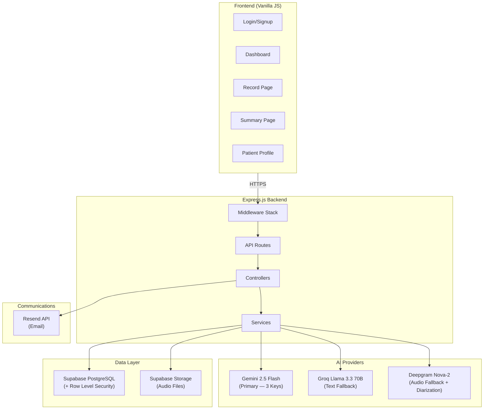
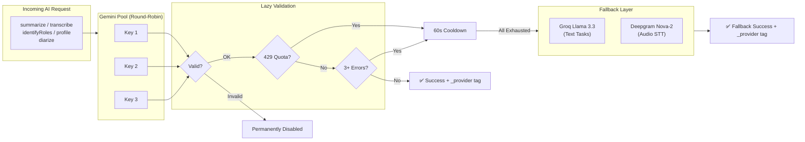
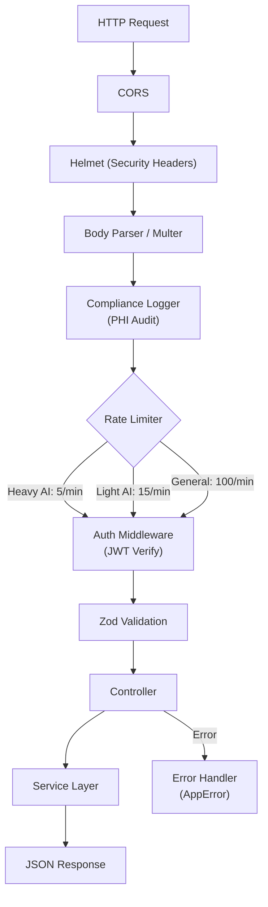
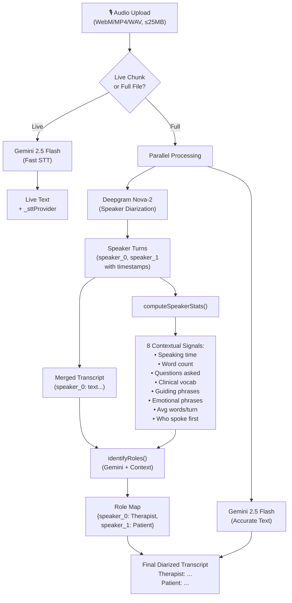
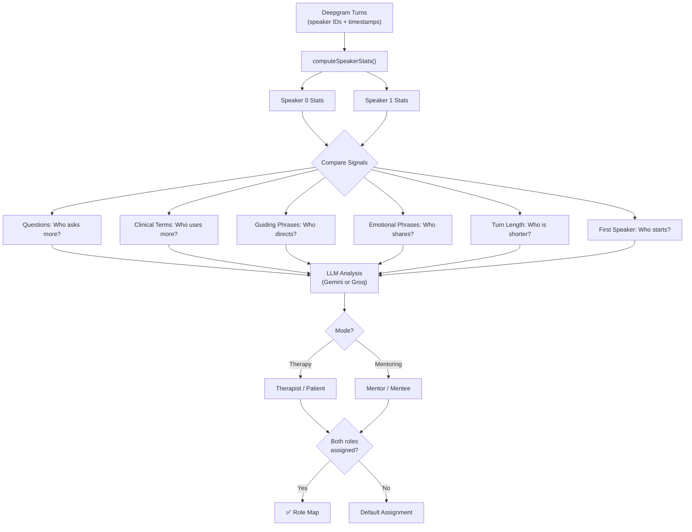
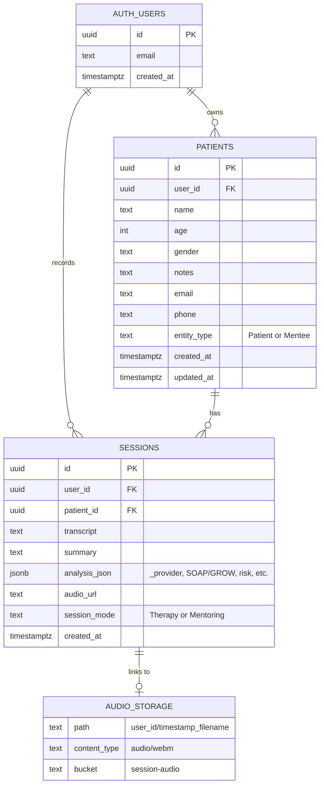
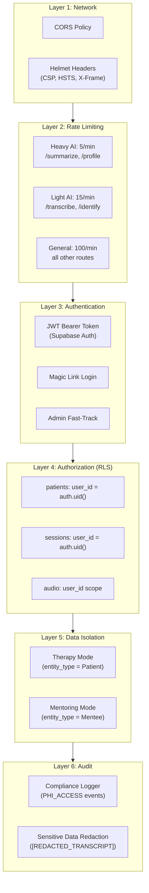
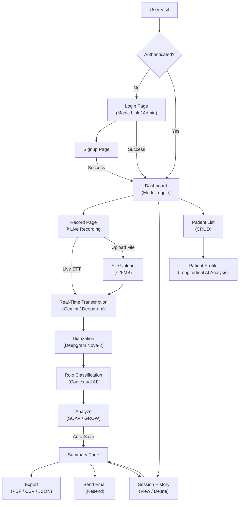
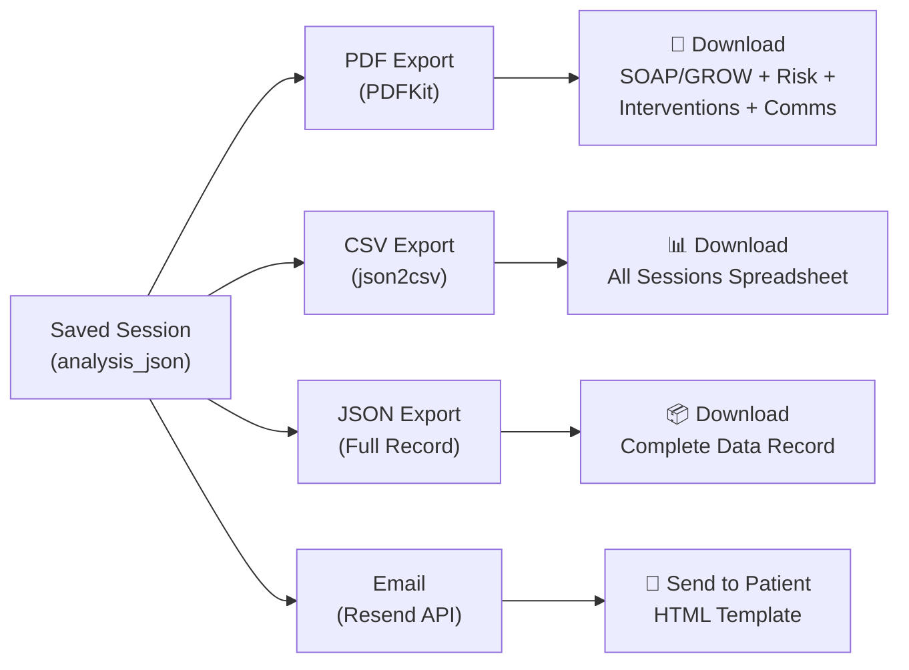

# EchoScribe v2.0 — Architecture Diagrams

---

## 1. System Overview



---

## 2. AI Multi-Provider Failover Architecture



---

## 3. Request Flow (Middleware Pipeline)



---

## 4. Audio Transcription + Diarization Pipeline



---

## 5. Role Classification Logic



---

## 6. Summarization & Analysis Pipeline

```mermaid
graph TD
    TRANSCRIPT["Diarized Transcript"]
    MODE{"Session Mode?"}
    
    TRANSCRIPT --> MODE
    
    MODE -->|Therapy| SOAP_PROMPT["SOAP Prompt<br/>(Clinical Specialist)"]
    MODE -->|Mentoring| GROW_PROMPT["GROW Prompt<br/>(Academic Mentor)"]
    
    SOAP_PROMPT --> GEMINI["Gemini 2.5 Flash<br/>(JSON output)"]
    GROW_PROMPT --> GEMINI
    
    GEMINI -->|Success| PARSE["Parse JSON Response"]
    GEMINI -->|Fail (3 retries)| GROQ["Groq Llama 3.3<br/>(Fallback)"]
    GROQ --> PARSE
    
    PARSE --> NORMALIZE["Normalize Fields"]
    
    NORMALIZE --> SOAP_OUT["SOAP: S/O/A/P"]
    NORMALIZE --> GROW_OUT["GROW: G/R/O/W"]
    NORMALIZE --> RISK["Risk Assessment"]
    NORMALIZE --> DIAG["Diagnostic Impressions"]
    NORMALIZE --> INTERV["Interventions Used"]
    NORMALIZE --> BOOKING["Auto-Booking"]
    NORMALIZE --> REFERRAL["Referral Form"]
    NORMALIZE --> COMMS["Patient Communication<br/>(EN + Translated)"]
    NORMALIZE --> META["Metadata<br/>(confidence, tone,<br/>topics, _provider)"]
    
    META --> SAVE["Auto-Save to Supabase"]
```

---

## 7. Database Schema (ERD)



---

## 8. Security & Access Control Layers



---

## 9. Dual-Mode Data Isolation

```mermaid
graph LR
    subgraph TherapyMode["🏥 Therapy Mode"]
        T_PAT["Patients<br/>(entity_type = Patient)"]
        T_SES["Sessions<br/>(session_mode = Therapy)"]
        T_SOAP["SOAP Notes"]
        T_RISK["Risk: suicidal_ideation,<br/>self_harm_risk"]
        T_DIAG["Diagnostic Impressions"]
        T_MED["Medication Changes"]
    end
    
    subgraph MentoringMode["🎓 Mentoring Mode"]
        M_MEN["Mentees<br/>(entity_type = Mentee)"]
        M_SES["Sessions<br/>(session_mode = Mentoring)"]
        M_GROW["GROW Notes"]
        M_RISK["Risk: academic_burnout,<br/>severe_distress_risk"]
        M_SKILL["Skill Progression"]
        M_GOAL["Goal Completion Rate"]
    end
    
    WALL["🔒 STRICT ISOLATION<br/>No cross-mode queries"]
    
    TherapyMode --- WALL
    WALL --- MentoringMode
```



---

## 10. Frontend Page Flow



---

## 11. Export & Communication Flow


